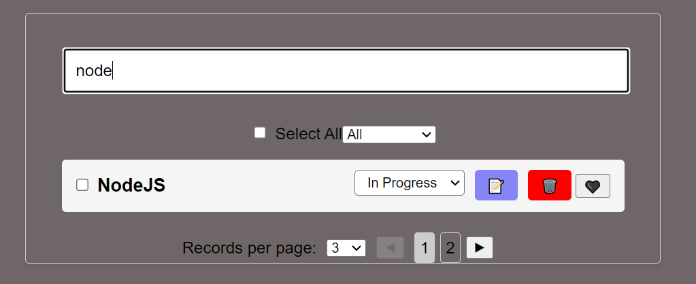
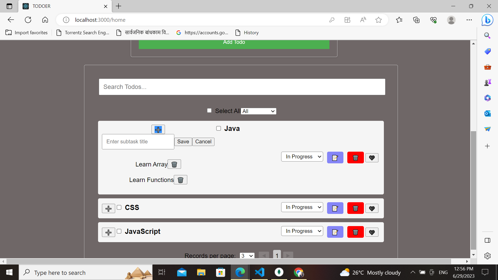

# TODOER using MERN stack and JWT Token Authentication.

## client-side

### `npm start`

Runs the app in the development mode.\
Open [http://localhost:3000](http://localhost:3000) to view it in your browser.

## server-side

### `npm start`

Runs the app in the development mode.\
Open [http://localhost:8000](http://localhost:8000) to view it in your browser.

## Features

- Add Todo: Allows users to add new todos with a title, description.
- Edit Todo: Clicking on the edit icon transforms the todo label into a textbox for editing. Pressing ENTER saves the changes.
- Change Todo Status: Users can update the status of a todo to mark it as in-progress, on-hold, or complete.
- Delete Todo: A confirmation dialog pops up before deleting a todo. Pressing delete permanently removes the todo.
- Select All: Provides an action to perform on all todos listed, such as marking them as complete or deleting them.
- Filter Todos: Users can filter todos based on status.
- Color-coded List: The todo list is visually enhanced with color codes based on the status of each todo.
- The application includes a search feature that allows users to search for specific todos. Users can enter a search term in the search input field, and the list will be filtered based on the matching titles. Pagination is also implemented to display the search results in a paginated manner, providing a better user experience when dealing with a large number of todos.
- The heart icon visually represents the favorite status, toggling between a filled heart (❤️) and an empty heart (🖤).Animate when hovering over the heart icon to provide visual feedback to the user.and Bookmarking Favorited Items.
- User Registration and JWT Token Authentication: When a user clicks on the "REGISTER" button, their details are securely stored in the database. If the user is successfully created, the client is redirected to the login page.
- User Login and Authorization: When a user clicks on the "LOG IN" button, the entered email and password are validated by the server to authenticate the user.
- Categories to every todo item.CRUD features include in category form.
- Add Subtasks for each todo item.
- Logout: When a user selects the "logout" option from the dropdown menu, their session data is cleared, and any necessary cleanup operations are performed.After the logout process is completed, the user is automatically redirected back to the login page.

## How to USE?

URL: ` http://localhost:3000`

### step 1:Users Registration using name,email, password.

### step 2:Users Login using email and password.

### step 3:Opens the home page

### step 4:Add Todo

- After adding categories
  

### step 5: Search Todo (type todo name and press enter)

### step 6: Delete Todo

### step 7:Filter Todo

### step 8:Select Todo

### step 9:Edit Todo (type todo name and press enter)

### step 10:Pagination

### step 11:Bookmark Todo

### step 12:Todo Status

### step 13:Add Category

### Add SubTasks

### step 14:Logout

